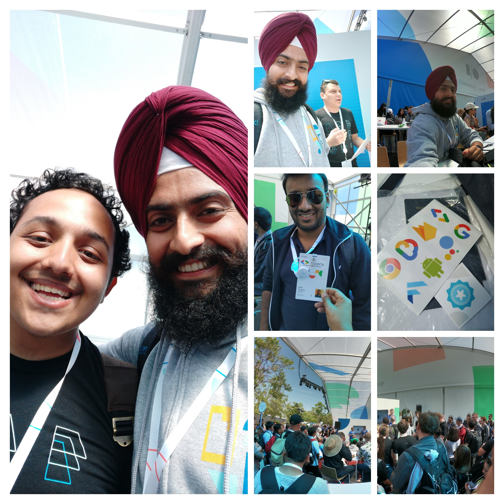
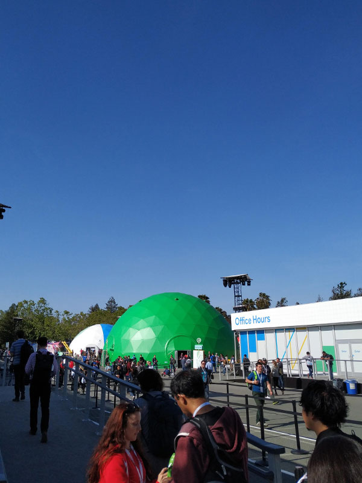
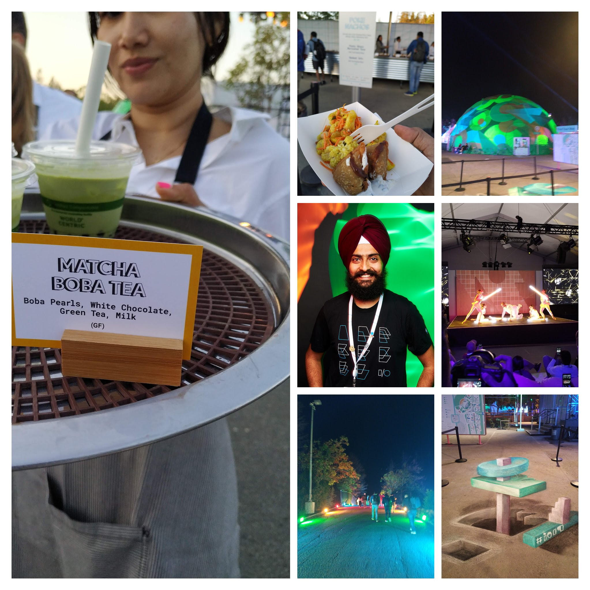
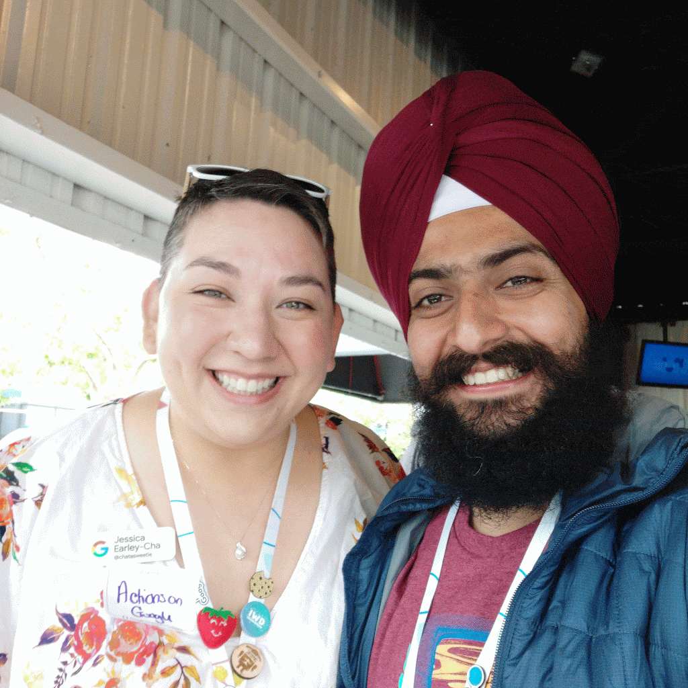

Google I/O Conference is the largest developer conference that’s is being held every year in Shoreline Theatre, Mountain View, CA, USA. With God’s grace and Mother's blessings, I got a chance to attend this conference from 7 May to 9 May 2019. The reason I being selected by Google India Skill Program is because I am a holder of Google’s Mobile Web Specialist Certification, which I had done the last year 2018 and my name is recommended by Google’s Certification Team. To know about that journey here is [Medium post link](https://medium.com/@singhnavdeep/dream-in-years-plan-in-months-evaluate-in-weeks-ship-daily-5e44fdf8eea1).

TLDR;

1. Networking with other developers around the globe.
2. Attend Community Lounge for different meetups and meet with other peeps.
3. Visit Sandbox stations for having hands-on experience of Google’s latest innovation and grab/win various swags.
4. Attend Codelabs and complete 4 code labs, get review from googlers and get chance to Win ticket for next I/O.
5. Visit Office Hours and App Reviews stations to get direct feedback from Googlers about your Website, App, Google Action or any other product you developed.
6. Attend your best speakers or interested topics sessions.

7 May With the full enthusiasm and excitement the Google I/O Keynote is started by Sundar Pichai (CEO of Google) of about 2 hours and followed by Developer Keynote.

The areas covered in Keynotes are Search, Google Lens, Duplex for the Web, Assistant, Privacy, Accessibility, Android, Hardware Updates, Developer Updates. For a quick overview, read[Harshit’s post](https://heartbeat.fritz.ai/google-i-o-2019-in-8-minutes-6b5d86b0a241).

The takeaways are:

Google Lens

* Google Lens in Search: Google Search now has built-in support for Google Lens to help users to quickly perform tasks like translation, voice narration, etc.
* GL on scanning restaurant’s menu can highlight favorite or starred food items in real-time and on scanning menu can do bill payment calculation easy for you.

Google Assistant

* The Machine Learning model that powers Google Assistant has been reduced to 0.5GB from the original 100GB, allowing for much faster responses.

Security

* Auto-delete for user history.

Accessibility

* Live Captioning

Web

* Chrome startup time is reduced by half, and V8 is now 2 times faster in parsing JavaScript and loading web pages.
* `loading=“lazy”`is an attribute for lazy loading (new)
* Chromebooks with Linux ready.
* Web.dev is one stop for all learning reality to the web.

After lunch having Spicy La Paz Wrap (vegan, dairy-free) yeah it was delicious and later spent time at Community Lounge and communicated with various GDG Organizers from various corners of the world like Egypt, Turkey, Uzbekistan, Nepal and on asking different questions to them got the swag (stickers) as a present.

Then after, Visited Office Hours for App reviews directly from Googlers. I discussed about my current google action`Hey Google, Open Cool Science Quiz`and come to know about the conversation design process, which is mandatory before developing any Google Action. The sessions I attended:

* [Live Coding A ML Model from Scratch](https://www.youtube.com/watch?v=_RPHiqF2bSs&list=PLOU2XLYxmsILVTiOlMJdo7RQS55jYhsMi&index=31&t=0s)
* [Work Less and Do More: Google Sheets for Node.js Developers](https://www.youtube.com/watch?v=xfXpuHBNkwo)
* [AMP for Email: Coming Soon to an Inbox Near You](https://www.youtube.com/watch?v=BFgC7WfbWjY)
* [Machine Learning Zero to Hero](https://www.youtube.com/watch?v=VwVg9jCtqaU)
* [Let’s Talk: Designing Quality Conversations for the Google Assistant](https://www.youtube.com/watch?v=ZRjkSqVedfY)

  

  Also attended Sandbox of Google Assistant, yes that big golf balls looking are Sandboxes areas where Google showcasing their latest innovations and developments.

  And later at night, had my dinner and attended Digital Detox Session Hall with mind-blowing dance performances.

  

  **8 May**

  The day is started with some workout at Hotel Wild Palms, Fitness Centre. Then way back to our destination by Google I/O provided a shuttle from Hotel to the venue then back forth at night. Things did this day:

  * Coding Challenge - (Using fetch API) is done at MWS (Mobile Web Specialist) Kiosk in 11 minutes and flashed my name at the leaderboard.
  * Quick Video Interview with Google Certifications Head (called JP) explaining about my benefits of becoming a Google Certified - Mobile Web Specialist.
  * Visited Sandboxes like AMP, Machine Learning & AI, Accessibility + Material Design, Cloud + Firebase, Web + Chrome OS + Payments and come to know a Codelab challenge that needs to be completed in 20 mins<https://codelabs.developers.google.com/codelabs/pay-web-checkout/index.html#0>Integrating the Google Pay API in nodejs application in glitch environment and Yes, I did that and win Google Chromecast as gift (Yippeeeeee)
  * Attended After Hours party at Ampitheatre, a performance by a band group using ML, i.e they recognized different dummy fruits by just touching them and on touching fruit speaks out its name.. Like Banana, Apple, Watermelon, etc.

    

    **9 May:**\
    \
    Its wrap-up day. Completed my all code labs and collected one of the last 4th stickers from[ Jessica](https://twitter.com/chatasweetie) and put in my card into a lucky draw box, to get an I/O ticket for next year. Then afterward attended a workshop with Sarah Clark - the Program Manager at Google Developer Training and she collected our reviews about a new website that is going to be launch soon for developers called google.dev likely it's UI/UX and there Moto was “CELEBRATE THE CODE WE SHARE”

    I tried to cover many things and get hands-on experience on various latest innovations by Googlers. Some useful links:

    * [Google I/O 2019 All Sessions](https://www.youtube.com/playlist?list=PLOU2XLYxmsILVTiOlMJdo7RQS55jYhsMi)
    * The Amazing stuff is summarized by`The Try Guys `is [here](https://www.youtube.com/watch?v=P6el3-VHQv8) Must watch stuff.
    * No time, No worries. [Google I/O 2019 event in 13 minutes](https://www.youtube.com/watch?v=wm2v6IpKXI4)

    What I learned is "`Doing is the Mantra`” because when you start doing stuff, the community is there to help you and grow you.

    Wish me the best of luck for next year Google I/O 2020.

    