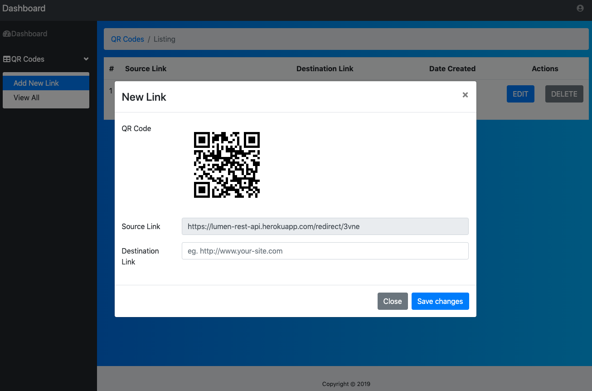

I love today’s world web technologies and thanks to various cloud platforms that allow developers to deploy their application to test and showcase, we can use any combination as per our need. Recently, I got the chance to get hands-on experience in using Reactjs Library in setting up SPA and Full-Stack Applications. I used Reactjs in different combinations. Hope it will give an overview to newbies.

**Reactjs and Lumen Application**  **Reactjs and Laravel Application**  **Reactjs and Express Application** 

<h1>Reactjs and Lumen Application</h1>

Demo: https://master.d30av2lsib94wx.amplifyapp.com/  Email: test@test.com  Password: test123 

For this I used separate folders to differentiate between front end and back end (api calls). Front end is developed using Reactjs and can be deployed in AWS Amplify ( I recommend ), or you have other options like Heroku, Netlify, Zeit and can deploy in EC2 instance of AWS. It’s truly depends on personal choice and available resources.

I love the option of Auto-deploy of application on Cloud, It auto push and deploy your changes when you git push your changes on linked git repository.

Backend application developed is basically to get API calls (REST), yet not tried GraphQL but will try it soon and its developed in slim and light php framework Lumen which is mini version of Laravel. I liked it as it provides php artisan to create containers, models, views, service providers and many many things using CLI.

This combination is best when you want separate codebase and deployment for frontend and backend.

<h1>#Reactjs and Laravel Application</h1>

Demo: NA to share

This is the official project. In this case, I used Laravel 5.8 as full-fledged code base, by default Laravel use Blade as a templating engine. But with some tweaks and alterations in code, we can use Reactjs as a template engine. You can use Vuejs too, as Laravel officially supports Vuejs. Again it’s up to your personal choice.

I used Admin Panel login authorization and created CMS using Laravel and for Routing Reactjs routes used separate route.

> This combination is best when you are a fan 🤩 of Laravel and want to use Reactjs as front end.

<h1>Reactjs and Express Application</h1>

Demo: http://falcon-digital.co/future-of-travel

This website I created for my company’s new venture which is a static website but need form validation and submission to MailChimp. Again I want to use Reactjs, so to handle server-side stuff rather use PHP I used Nodejs.

Before :

1. Create HTML pages for static pages.
2. Create a PHP page for server-side render or handling.
3. Use jQuery to handle the client-side form submission.

After :

1. Create Pages in Reactjs
2. As Reactjs installed over nodejs, so nodejs is being used to handle server-side stuff.
3. Reactjs to handle form submission itself.

This combination is best when you have a small application which need server intervention too.