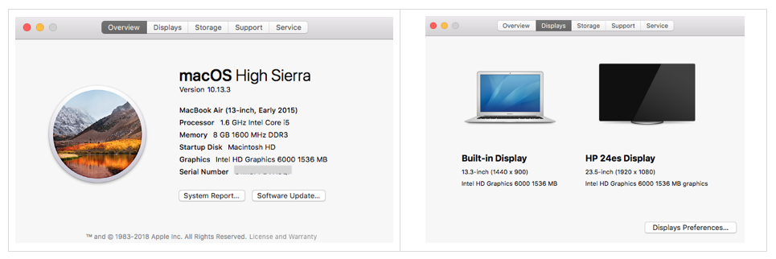

Every Developer dreamt to use a Robust machine that never slows down, nor heats up even working non-stop 24 hours :D

So this comes alive up by buying my first MACBOOK AIR having SSD. Yeah Solid State Drive means No Hard Drive, no revolving of hard disks so neither heats up and nor Fan to cool down. All it seems like working like a Silent Assassin. I am kinda LOVE it.

And other solid reason was Terminal of Mac. As you know In this NODEJS world, most tutorials available online are gave priority to MAC users. I mean most creative and innovative work being done on macOS. (Disclaimer: For Win users, the thoughts are truly personal)

My Mac specifications are as below in screenshots:

With 256GB SSD, Yeah I know this is lesser than Windows Hard disk memory trend 1TB. But SSDs are more costlier than HD.

Additionally I bought 24inches High Definition Screen. Working on a wide screen is easy for eyes and your back. Although I working from home since 2011 I didn’t worked directly on Laptop. Always attached as screen sharing device. As health perspective it never advisable to work on Laptop directly for long hours, it costs your neck, back, and ultimately your health. That's why I love my setup.

It didn’t take many days to settle me on Mac after using Windows from many many years. While coding, selecting the whole line using the keyboard was tough, but I found from Apple community, It’s done via Command ⌘ + Shift ⇧ + Arrow Right or Left

After buying my Mac, I found a worth list on Medium having must-install Apps for Mac. Reference:<https://blog.producthunt.com/the-34-best-mac-menu-bar-apps-b682260e0014>