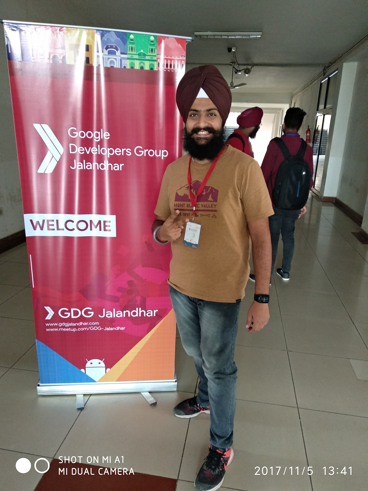
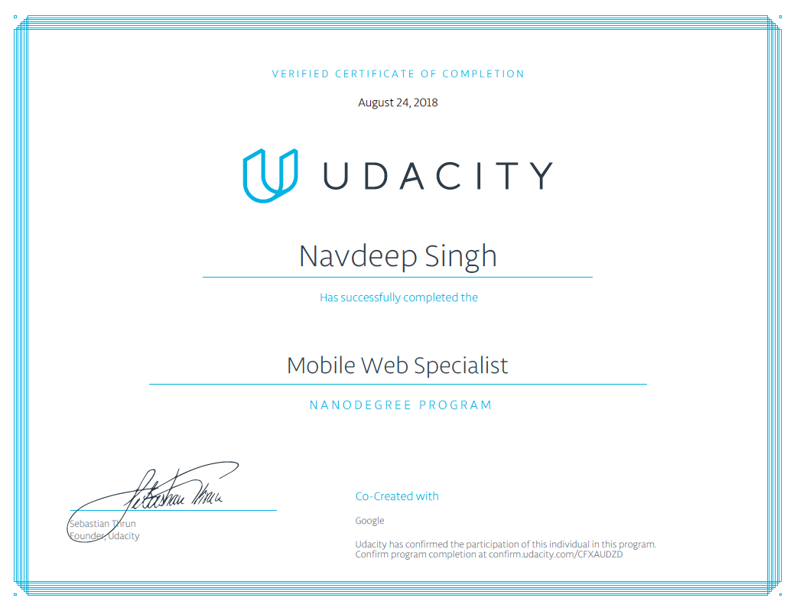
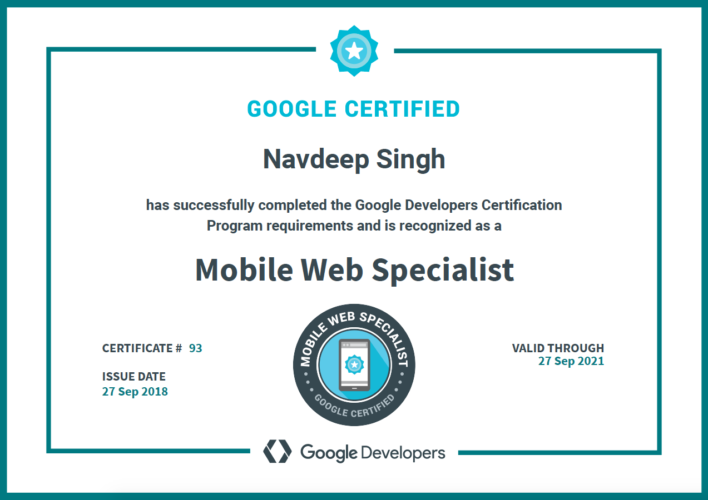

In today’s world, we obsessed with learning all stuff at all time. But in a real case, this is not straightforward. Let me share with you my journey how I nailed down Google Mobile Web Specialist Certification in 4 months.

I attended a GDG (Google Developer’s Group) meet last year November 2017. And come to know that Google has many Certifications like Android Programmer Certifications, Mobile Web Specialist and like many more which basically related to a programmer/developer. During those days as I already switched my career from Backend developer to a Front-end developer to better understand the aspects of Front-end development. What I say “I want to become a specialist in UI/UX”.

So I overjoyed to get one of that certification for me. So my main target in the next months was clear to become “MOBILE WEB SPECIALIST” and Gain knowledge in that regard.

One of my friend and ex-colleague Alex mentioned this quote. And it sticks in my head.

Dream in Years. Plan in Months. Evaluate in Weeks. Ship Daily.

# Exam Content

The exam covers 8 main topics

* Basic Website Layout and Styling
* Front End Networking
* Accessibility
* Progressive Web Apps
* Performance Optimization and Caching
* Testing and Debugging
* ES2015 Concepts and Syntax
* Mobile Web Forms

You can refer to their Study Guide \[here](<https://developers.google.com/training/certification/mobile-web-specialist/StudyGuide_MobileWebSpecialist.pdf>)

# Exam Preparation

The planning to nail it was already started in my mind. So the research about its syllabus and various norms get started and paid 99$ to give exam for this. With just a little preparation I attempted my first attempt to test how deep is water with my one leg, I mean to get proper knowledge of questions type, the range of difficulty, exam environment, exit interview etc.. The grading process took 45 days. I knew that I will not pass in the first attempt.

It was clear I need to prepare more hard to clear the exam. So the next plan made to nail it. The plan was to get formal training for the syllabus to cover. I applied for Nanodegree on Udacity’s course. As it is a very costly course. So I remember and confirmed from my current’s company Falcon Agency to fund for it. They have already the policy of funds for Learning and Health Perspectives. Then after I utilized this chance and enrolled for Mobile Web Specialist Nanodegree.

The course contains 3 Projects to get graduation certification.

1. The project was related to UI aspects.
2. The project was an upgrade of the 1st project and covers basic concepts of Service Workers and IndexedDB.
3. The project was an upgrade of the 2nd project and having full performance, Progressive, Accessibility app with ratings > 90 in Lighthouse Audit under Chrome Developer tools.

After the 2nd Project finish. My date for the 2nd attempt for GMWS Exam has come. I attempted my 2nd attempt. This time I morally up and confident that I will pass it. Then wait for the grading process starts again.

Meanwhile, Learning day by day from their detailed Video Tutorials and Quizzes in between and Finishing Projects one by one I graduated within 2 months.

I overjoyed again with Certificate and my knowledge of various technical aspects that make me Graduate from Udacity’s Nanodegree.

And then after waiting for about 45 days. I got an email with the subject line ‘Congratulations, you are now a Google Certified Mobile Web Specialist!’ And I got my badge and certificate as below and available online.

# Knowledge and Experience Attained

* PWAs (Progressive Web Apps)
* Service Workers,
* Performance Optimization and Caching,
* Testing and Debugging
* Flexbox and Griding system
* Accessibility
* And many other topics.

If you too going to prove your self with this Mobile Web Certification Exam and having any doubt or concern, I will be more happy to help. You can reach me through DM on twitter @nswebstudio. Thank You.