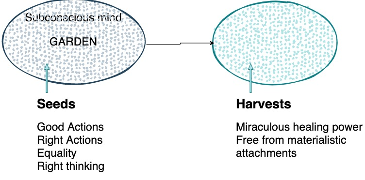

I starting listening to the Audible book titled "**The Power of Your Subconscious Mind**" written by [Dr. Joseph Murphy](https://en.wikipedia.org/wiki/Joseph_Murphy_(author)). The author motivated us to use our Subconscious mind with numerous examples. In the 1st Chapter titled "**The Treasure-house within you**", the thoughts of the author revolve around this topic. His main motive in this chapter is to impart the difference between the Conscious Mind and Subconscious Mind, How these parts work collaboratively, and what may become the consequences and effects.

Firstly, the author described the difference between Magnetise man and De-magnetise man, former knows the master secret of the ages which is "the marvelous power of Subconscious mind" and the latter will always be surrounded with negative thoughts like "I'm afraid, I can't afford it". This power can't attain, we already possessing it, the trick is how to use it. The infinitive intelligence imparts knowledge and eventually can help to find the ideal partner, mentor, course, career, etc. in its life span.

`Law of your mind is Law of belief`

Afterwards, the author discussed Duality of Mind and categorised the conscious mind as a rational mind and the subconscious mind as an irrational mind. Later on, the author used two separate analogies to exemplify how both the Conscious mind and the Subconscious mind work together.

The First analogy is to assume your Mind as a Garden, soil as your subconscious mind, every day with our habitual thinking we keep sowing seeds in it. If we sow seeds like good actions, good thinking, equality, right actions then one can harvest glorious reaps. 

